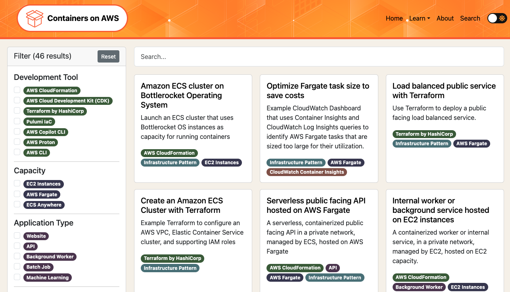

## Containers on AWS

This repository hosts the source content for patterns on https://containersonaws.com/

If you would like to add your own pattern to the website please read the guide below.

## Documentation

- [Understand the repository structure](./docs/structure.md)
- [Add yourself as an author](./docs/add-yourself-as-an-author.md)
- [Add your pattern](./docs/add-a-pattern.md)
- [Add a great SVG diagram for your pattern](./docs/svg-diagram-process.md)
- [General contribution guidelines](./CONTRIBUTING.md)

## Security

See [CONTRIBUTING](CONTRIBUTING.md#security-issue-notifications) for more information.

## License

This project is licensed under the Apache-2.0 License.
