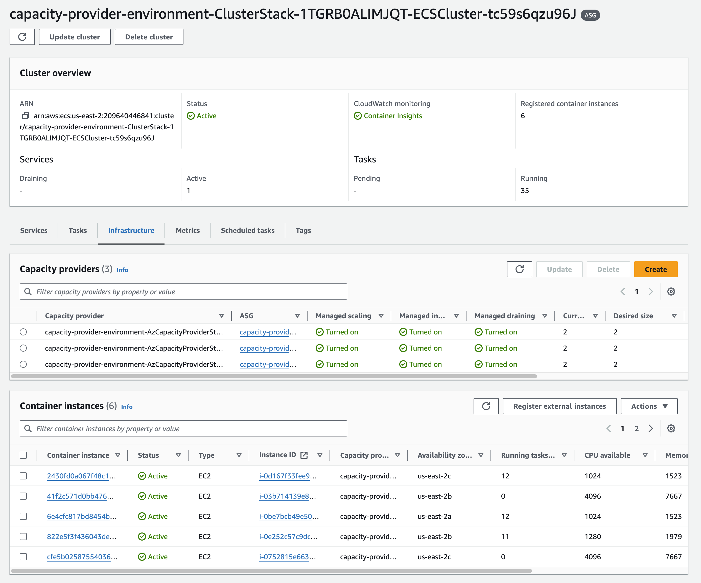

#### About

[Amazon Elastic Container Service](https://aws.amazon.com/ecs/) is a serverless orchestrator that manages container deployments on your behalf.

Capacity providers are a built-in feature of Amazon ECS. A capacity provider launches Amazon EC2 capacity automatically whenever you need compute capacity to run containers.

This reference architecture shows how to create a set of zonal capacity providers, and use a capacity provider strategy to evenly distribute ECS tasks across multiple zonal capacity providers.

#### Why?

Amazon ECS comes with built-in placement strategies that serve the vast majority of workloads. In specific you could use the following "AZ balanced binpack" strategy to tell Amazon ECS to distribute containers evenly across multiple availability zones, while densely utilizing CPU in order to save infrastructure cost where possible:

```txt
spread(attribute:ecs.availability-zone), binpack(CPU)
```

However, task placement strategies are a best effort. Amazon ECS still places tasks even when the most optimal placement option is unavailable.

This means that in some circumstances Amazon ECS may choose to place an excessive number of tasks into one or two AZ's. The following diagrams demonstrate one scenario in which this may occur.

Imagine a cluster of three instances distributed across three availability zones. Each instance has capacity to run four tasks:

!!! @/pattern/balanced-ecs-on-ec2-container-deployment-across-az/empty.svg

Now you launch service A which deploys four copies of container A, distributed across availability zones:

!!! @/pattern/balanced-ecs-on-ec2-container-deployment-across-az/container-a.svg

Because there is one more task than there are availability zones and instances, the first instance in the first AZ gets two tasks instead of one.

Now you deploy a second service B, which deploys four copies of container B:

!!! @/pattern/balanced-ecs-on-ec2-container-deployment-across-az/container-b.svg

Because of the "binpack" part of the strategy, the first instance in the first AZ is once again selected to get two tasks instead of a single task. That instance is now packed full of tasks and can not host any additional tasks.

Now you deploy a third service C, which deploys four copies of container C:

!!! @/pattern/balanced-ecs-on-ec2-container-deployment-across-az/container-c.svg

This time the only instances that still have capacity are the two instances in the second and third availability zone. As a result these two instances each get two tasks.

The problem is that this third service is not actually distributed across all availability zones. If the workload had a high availability requirement to be distributed across three availability zones, then this reduced availability distribution may not be acceptable.

This is not the only scenario in which ECS tasks may end up unbalanced. Rolling deployments and scaling up may also choose to make denser usage of the currently available capacity rather than launching additional instances. This results in a deployment that is excessively concentrated into a single availability zone or two availability zones. In the best case the deployment is just excessively weighted in favor of one availability zone. In the worst case all tasks for a service could end up placed onto capacity from a single AZ.

In general, this problem gets less serious with larger services that have more desired count, and with an increased number of availability zones. However, instead of relying on higher scale and random chance, you can also utilize ECS capacity providers to enforce evenly balanced task placement.

#### Architecture

The following diagram shows how this reference architecture solves for even task balancing across availability zones:

!!! @/pattern/balanced-ecs-on-ec2-container-deployment-across-az/three-az.svg

1) Instead of one large EC2 Auto Scaling group that spans all three availability zones, there is a separate EC2 Auto Scaling group for each availability zone.
2) Each Auto Scaling group is linked to it's own ECS capacity provider.
3) An ECS capacity provider strategy is configured to distribute tasks for the service evenly across the three capacity providers.
4) Each capacity provider then manages the capacity for it's own zone, allowing zones to independently scale to a larger size if necessary to maintain a distributed task placement.

In the above example the same three services have been placed into the cluster. This time they are evenly balanced across all three availability zones. This has been accomplished by scaling up the first AZ to a larger size, while keeping some wasted space on the other two AZ's. As a result there is one entire instance of aggregate wasted compute capacity, but all three services are distributed across all three AZ's.

:::warning
This approach will deliberately waste EC2 capacity in order to evenly distribute tasks across availability zones. This capacity provider strategy is not optimized for cost. It is optimized for high availability.
:::

#### Dependencies

This pattern requires the following local dependencies:

* AWS SAM CLI for deploying CloudFormation stacks on your AWS account. You should follow the appropriate [steps for installing SAM CLI](https://docs.aws.amazon.com/serverless-application-model/latest/developerguide/install-sam-cli.html).

This architecture will be defined as a series of separate infrastructure as code modules that are linked together by a parent file that defines the application as a whole. Download each the following files. Instructions for deployment will follow.

#### Define the ECS cluster

This following `cluster.yml` file defines an ECS cluster, plus some supporting infrastructure that will be reused later on.

<<< files/cluster.yml

Things to look for:

* `CustomAsgDestroyerFunction` - This custom CloudFormation resource helps clean up the stack faster on tear down
* `CustomEniTrunkingFunction` - A custom CloudFormation resource that [enables ENI trunking for the EC2 instances](https://docs.aws.amazon.com/AmazonECS/latest/developerguide/container-instance-eni.html)

#### Define a zonal capacity provider

Now download the following `single-az-capacity-provider.yml` file, to define an Auto Scaling Group and capacity provider for each availability zone:

<<< files/single-az-capacity-provider.yml

This pattern will be reused one time for each different AZ that we wish to host tasks in. Things to look for in this template:

* `AWS::AutoScaling::AutoScalingGroup` - The Auto Scaling group that will launch EC2 instances. Notice that this is a single zonal Auto Scaling group.
* `AWS::ECS::CapacityProvider` - The ECS capacity provider that will scale the Auto Scaling group up and down in response to task launches
* `Custom::AsgDestroyer` - This instantiates the custom CloudFormation resource that destroy the Auto Scaling Group on stack teardown.

#### Define the capacity provider association

In order to use a capacity provider with an ECS cluster it must first be associated with the cluster. This `capacity-provider-associations.yml` file defines this association:

<<< files/capacity-provider-associations.yml

Things to note:

* A default capacity provider strategy is configured to distribute tasks evenly across each of three capacity providers. You can tune the `Base` later on depending on the total size of your deployment, but the `Weight` should be set to one for all capacity providers.
* If you expect to launch a large number of containers then you could utilize the capacity provider strategy `Base` to ensure that a minimum number of tasks are always deployed to each capacity provider. For example if you expect to always run more than 300 tasks, you could set a base of one hundred on each capacity provider. The first 300 tasks will always be distributed perfectly evenly across the three capacity providers. Any remaining tasks will be distributed evenly across the capacity providers. This can help ensure even balance even under unusual circumstances such as all tasks in specific AZ crashing and undergoing replacement at the same time.

#### Define a service

When launching a service in the cluster you need to specify a capacity provider strategy on the service as well. This `service-capacity-provider.yml` defines the service that will run in the cluster, and distributes it across all three capacity providers:

<<< files/service-capacity-provider.yml

Things to note:

* By default this template deploys 35 tasks. Consider increasing or decreasing this value as part of your test workload.

#### Put it all together

It's time to deploy all this infrastructure. The following serverless application definition ties all the pieces together:

<<< files/parent.yml

Note that this `parent.yml` file defines three copies of the `single-az-capacity-provider.yml` stack, one copy for each availability zone.

#### Deploy

You should now have five files:

* `cluster.yml` - Define the ECS cluster and supporting infrastructure
* `single-az-capacity-provider.yml` - Define an Auto Scaling group and ECS capacity provider for a single zone
* `capacity-provider-associations.yml` - Links multiple capacity providers to the ECS cluster
* `service-capacity-provider.yml` - Defines a service distributed across three capacity providers
* `parent.yml` - Instantiates the other YAML files, including creating three copies of the zonal capacity provider

You can use the following commands to deploy the reference architecture to your account, using the default VPC. If you wish to utilize a dedicated VPC for this workload, then consider downloading and deploying the ["Large sized VPC for an Amazon ECS cluster"](large-vpc-for-amazon-ecs-cluster) as part of this `parent.yml` stack.

```sh
# Get the VPC ID of the default VPC on the AWS account
DEFAULT_VPC_ID=$(aws ec2 describe-vpcs --filters Name=is-default,Values=true --query 'Vpcs[0].VpcId' --output text)

# Grab the list of subnet ID's from the default VPC, and glue it together into a comma separated list
DEFAULT_VPC_SUBNET_IDS=$(aws ec2 describe-subnets --filters Name=vpc-id,Values=$DEFAULT_VPC_ID --query "Subnets[*].[SubnetId]" --output text | paste -sd, -)

# Now deploy the ECS cluster to the default VPC and it's subnets
sam deploy \
  --template-file parent.yml \
  --stack-name capacity-provider-environment \
  --resolve-s3 \
  --capabilities CAPABILITY_IAM \
  --parameter-overrides VpcId=$DEFAULT_VPC_ID SubnetIds=$DEFAULT_VPC_SUBNET_IDS
```

#### Test it out

Use the Amazon ECS console to inspect the details of the cluster that was just deployed. You should see something similar to this:



Scale the service up and down and observe that perfect balance is achieved across each availability zone.

:::warning
Notice that each of the three capacity providers scales out to a minimum of two instances. This is because each capacity provider wants to provide high availability for itself, so it launches more than one instance to spread the tasks across. By separating the availability zones into three capacity providers we have created some extra redundancy across each zonal capacity provider. For this reason, this architectural approach is more intended for extremely large deployments, where there will be less overhead wasted space as each zonal capacity provider will be fully utilizing more than two EC2 instances anyway.
:::

#### Operational Caveats

While this approach functions very well under typical circumstances, there is a caveat to consider for large deployments in the event of an availability zone outage.

If one of the zonal capacity providers is unable to provide capacity, then the tasks that are distributed to that capacity provider will not be able to be launched. Instead they will wait in `PROVISIONING` state until the capacity provider is able to obtain capacity.

Amazon ECS also has a per cluster limit on the number of tasks that can be in the `PROVISIONING` state. This limit is set to 500 tasks. Therefore if you have a deployment of 1500 tasks, distributed across three zonal capacity providers, and for some reason an entire availability zone of capacity is lost, there will be 500 tasks waiting in the `PROVISIONING` state. This may block other task launches for a time, until capacity is restored or the provisioning tasks time out and fail to launch.

To recover from such a scenario you could update your service's capacity provider strategy to temporarily remove the failing availability zone from the capacity provider strategy, and force an update to the service.

For smaller deployments where there would be fewer than 500 tasks stuck in `PROVISIONING` state there will not be any issue of task launch deadlocks. You may still wish to respond to a zonal outage by scaling your service up to a larger size to distribute more tasks to the remaining zonal capacity providers. ECS will not automatically redistribute the `PROVISIONING` tasks to other capacity providers because the capacity provider strategy demands perfect balance.

#### Tear it Down

You can tear down the infrastructure created by this reference architecture by using the following command:

```sh
sam delete --stack-name capacity-provider-environment --no-prompts
```