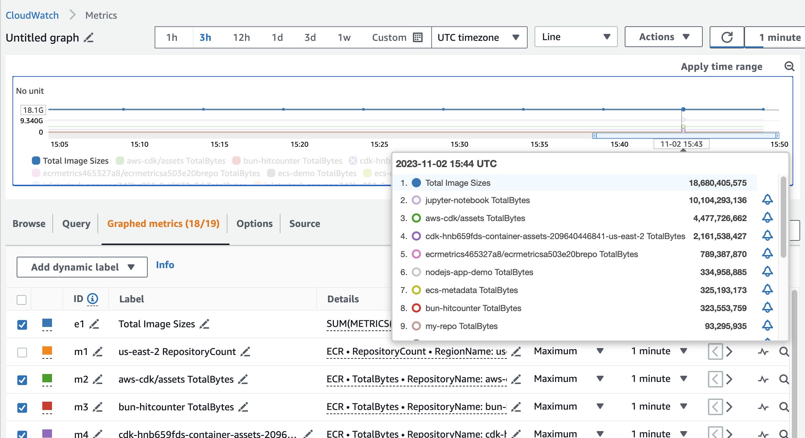

#### About

[Amazon Elastic Container Registry (ECR)](https://aws.amazon.com/ecr/) is a fully managed registry that makes it easy to store, share, and deploy your container images.

[Amazon CloudWatch](https://aws.amazon.com/cloudwatch/) is the built-in service for monitoring applications and resource usage on your AWS account.

This pattern will help you setup tooling to gather Amazon ECR stats and put them into Amazon CloudWatch so that you can keep track of the growth of your ECR image storage over time, and set up custom alarms based on your desired threshold.

#### Architecture

You will deploy the following infrastructure:

!!! @/pattern/ecr-image-size-and-count-usage-metrics/diagram.svg

1. EventBridge Scheduler invokes a Lambda function on a schedule of your choice
2. The Lambda function uses the AWS SDK to fetch metadata about your ECR repositories
3. The Lambda function puts the metadata into CloudWatch as a metric.

#### Dependencies

This pattern uses AWS SAM CLI for deploying CloudFormation stacks on your account.
You should follow the appropriate [steps for installing SAM CLI](https://docs.aws.amazon.com/serverless-application-model/latest/developerguide/install-sam-cli.html).

Additionally, you need to clone the following [open source git repo](https://github.com/miketheman/ecr-metrics):

```
git clone https://github.com/miketheman/ecr-metrics.git
```

#### Dig into the application

This open source project is a Python project with the following structure:

```sh
$ tree ecr-metrics

ecr-metrics
├── Dockerfile
├── LICENSE
├── README.md
├── TODO.md
├── poetry.lock
├── pyproject.toml
├── src
│   └── ecr_metrics
│       └── main.py
├── template.yml
└── tests
    ├── responses.md
    └── test_main.py

3 directories, 10 files
```

`src` contains the code for the Lambda function that actually iterates through ECR repositories, gets the metric values, and then puts those metric values into CloudWatch Metrics.

Let's look at a couple of the files in specific:

`Dockerfile` defines how to build and package this open source code into a container image that can run in AWS Lambda.

<<< @/pattern/ecr-image-size-and-count-usage-metrics/files/Dockerfile{Dockerfile}

`template.yml` is a SAM template defines how to deploy the container image as a serverless Lambda function that runs on a cron schedule.

<<< @/pattern/ecr-image-size-and-count-usage-metrics/files/template.yml

Note the `rate(30 minutes)`. You can change this depending on how frequently developers push images to ECR, and how granular you would like the metric to be.

#### Build the application

First, use SAM to build the container image.

```sh
cd ecr-metrics
sam build
```

To verify it worked, look for the `.aws-sam` folder that was created. This folder contains a version of the template that references the actual Docker image that was built.

You can also use the following command to run the Lambda function locally:

```sh
sam local invoke
```

You will see output similar to this:

```txt
$ sam local invoke
Invoking Container created from ecrmetrics:latest
Building image.................
Using local image: ecrmetrics:rapid-x86_64.

START RequestId: 8bdd3544-6d26-437b-9a7c-f877ec408909 Version: $LATEST
END RequestId: 8bdd3544-6d26-437b-9a7c-f877ec408909
REPORT RequestId: 8bdd3544-6d26-437b-9a7c-f877ec408909  Init Duration: 0.12 ms  Duration: 1332.63 ms Billed Duration: 1333 ms        Memory Size: 128 MB     Max Memory Used: 128 MB
null
```

Now that we know it works, it's time to deploy the live version to your AWS account.

#### Deploy the application

You can use the SAM template to deploy the built container image and setup the scheduled Lambda function on your AWS account:

```sh
sam deploy \
  --capabilities CAPABILITY_IAM \
  --resolve-s3 \
  --resolve-image-repos \
  --stack-name ecr-metrics
```

#### Test it Out

Wait a few minutes and then check inside of CloudWatch Metrics. You will see a new custom namespace called "ECR" with metrics for each of your ECR repositories, similar to the following screenshot:



#### Tear it Down

If you are no longer interested in tracking ECR metrics you can tear down the deployment with:

```sh
sam delete --stack-name ecr-metrics
```