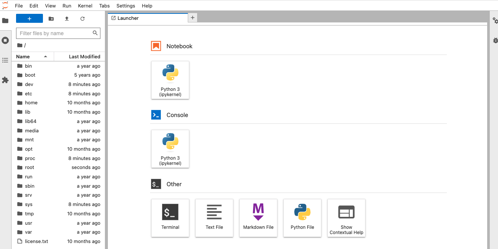
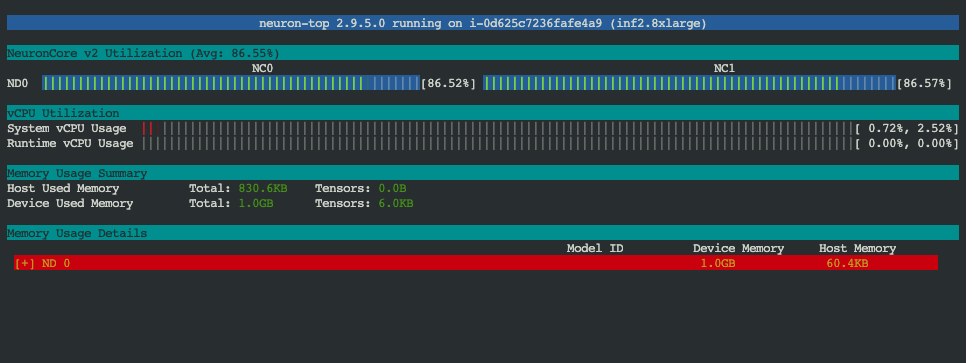

#### About

[Jupyter Notebook](https://jupyter.org/) is a web-based interactive computing platform. It is popular for machine learning and as an IDE for developing in multiple programming languages. JupyterLab is the latest version of Juypter notebook, with a more IDE like experience, and modular, extendable design.

[AWS Inferentia](https://aws.amazon.com/machine-learning/inferentia/) accelerators deliver high performance at the lowest cost for your deep learning (DL) inference applications. When training your models use [AWS Trainium](https://aws.amazon.com/machine-learning/trainium/) Instances, which are optimized for model training.

[AWS Neuron](https://aws.amazon.com/machine-learning/neuron/) is an SDK which runs your machine learning models on the underlying hardware acceleration of AWS Inferentia or AWS Trainium.

This pattern will show how to build and deploy a containerized version of Jupyter notebook, with the AWS Neuron SDK for machine learning, accelerated by AWS Inferentia and AWS Trainium hardware.

::: warning
This pattern is designed to setup a production ready machine learning environment that can be scaled up later for running extremely large machine learning training or real time inference jobs accelerated by some of the most powerful hardware that AWS has. Therefore this pattern has a fairly high baseline cost (about $2 an hour, and the largest instance choice available costs >$12 an hour). Consider using [Amazon Sagemaker Notebooks](https://aws.amazon.com/sagemaker/notebooks/) on smaller EC2 instances for a low cost learning environment that is free tier eligible.
:::

#### Setup

If not already installed, ensure that you have the following dependencies installed locally:

* [Docker](https://www.docker.com/) or other OCI compatible container builder. This will be used to prepare a custom JupyterLab image.
* [Amazon ECR Credential Helper](https://github.com/awslabs/amazon-ecr-credential-helper). This will assist you with uploading your container image to Amazon Elastic Container Registry.
* [AWS SAM CLI](https://docs.aws.amazon.com/serverless-application-model/latest/developerguide/install-sam-cli.html). This tool will help you deploy multiple CloudFormation stacks at once and pass values from one stack to the next automatically.

#### Architecture

The following diagram shows the architecture of what will be deployed:

!!! @/pattern/jupyter-notebook-inference-container-cloudformation/diagram.svg

1. An Application Load Balancer provides ingress from the public internet.
2. Traffic goes to an `inf2.8xlarge` AWS Inferentia powered EC2 instance launched by Amazon ECS. You can adjust the AWS Inferentia instance class as desired.
3. Amazon ECS has placed a container task on the instance, which hosts JupyterLab and the AWS Neuron SDK.
4. Amazon ECS has connected the container to the underlying Neuron device provided by the AWS Inferentia instance.
5. Machine learning workloads that you run inside the container are able to connect to the hardware accelerator.
6. Access to the JupyterLab notebook is protected by a secret token that is stored in AWS Secrets Manager. Amazon ECS manages retrieving this secret value and injecting it into the Jupyter server on container startup.

#### Build a Jupyter notebook container

In order to build a Jupyter notebook container image we will start with a prebuilt container image from the [AWS Deep Learning Container collection](https://github.com/aws/deep-learning-containers), then install JupyterLab on top of it:

```Dockerfile
FROM 763104351884.dkr.ecr.us-west-2.amazonaws.com/pytorch-inference-neuronx:1.13.0-neuronx-py38-sdk2.9.0-ubuntu20.04
RUN pip install jupyterlab
CMD jupyter-lab
```

Create the `Dockerfile` and then build the custom image locally:

```shell
docker build -t jupyter-notebook .
```

Now we need to create an Amazon Elastic Container Registry:

```shell
aws ecr create-repository --repository-name jupyter-notebook
```

You should get a response similar to this:

```json
{
  "repository": {
      "repositoryUri": "209640446841.dkr.ecr.us-east-2.amazonaws.com/jupyter-notebook",
      "imageScanningConfiguration": {
          "scanOnPush": false
      },
      "encryptionConfiguration": {
          "encryptionType": "AES256"
      },
      "registryId": "209640446841",
      "imageTagMutability": "MUTABLE",
      "repositoryArn": "arn:aws:ecr:us-east-2:209640446841:repository/jupyter-notebook",
      "repositoryName": "jupyter-notebook",
      "createdAt": 1683047667.0
  }
}
```

Copy the `repositoryUri` as this is how you will interact with the repository. Use similar commands to tag your built image and then push it to Amazon ECR:

```shell
docker tag jupyter-notebook 209640446841.dkr.ecr.us-east-2.amazonaws.com/jupyter-notebook:latest
docker push 209640446841.dkr.ecr.us-east-2.amazonaws.com/jupyter-notebook:latest
```

::: info
If you get a `401 Unauthorized` error then make sure you have installed the [Amazon ECR credential helper](https://github.com/awslabs/amazon-ecr-credential-helper) properly. It will automatically use your current AWS credentials to authenticate with the ECR repository on the fly.
:::

#### Define a VPC for the workload

The following CloudFormation file defines a VPC for the workload.

<<< files/vpc.yml

For more info about this VPC see the pattern ["Large sized AWS VPC for an Amazon ECS cluster"](/large-vpc-for-amazon-ecs-cluster).

#### Define Amazon ECS cluster of AWS Inferentia instances

The following CloudFormation file defines an Amazon ECS cluster that launches AWS Inferentia instances as capacity for running containers. These instances have hardware acceleration that is optimized for running machine learning inference jobs.

<<< files/inferentia-cluster.yml

By default this template deploys `inf2.xlarge` instances. You can launch additional tasks in the Amazon ECS cluster to automatically scale out the number of AWS Inferentia instances. If you plan to run containers that do not need machine learning acceleration, then do not use this pattern, and instead deploy a cluster that uses a less expensive EC2 instance that is compute optimized instead of machine learning optimized.

#### Define the Juypter notebook task

The following CloudFormation template deploys a Jupyter Notebook task under Amazon ECS orchestration:

<<< files/jupyter-notebook.yml

Some things to note:

You will need to pass the `ImageUrl` parameter so that the stack launches the container image URI that you just uploaded to Amazon ECR. This will be handled later when we deploy the parent stack.

In the `ContainerDefinitions[0].LinuxParameters` section you will see that the task definition is mounting the `/dev/neuron0` device from the host into the container. This is what gives the Neuron SDK inside the container the ability to utilize the underlying hardware acceleration. Extremely large `inf2` instances have multiple `neuron*` devices that need to be mounted into the container.

The template generates an `AWS::SecretsManager::Secret` resource as the secret token used to protect the Jupyter notebook from unauthorized access. You will see this token passed in as a `Secret` in the task definition body.

The `MyIp` parameter can be customized to limit which IP addresses are allowed to access the JupyterLab.

This task definition creates an EFS filesystem and mounts it to the path `/home`. This can be used as durable persistence for models or other important info that you want to save from your Jupyter notebook. Otherwise everything else in this notebook will be wiped on restart because the container's filesystem is fundamentally ephemeral. However `/home` directory will survive restarts. See the [tutorial on attaching durable storage to an ECS task](cloudformation-ecs-durable-task-storage-with-efs) for more information on using EFS for durable task storage.

#### Deploy all the stacks

We can use the following parent stack to deploy all three child CloudFormation templates:

<<< files/parent.yml

Use AWS SAM CLI to deploy the parent stack with a command like this one. You will need to substitute in your own `ImageUrl` value from the container image that you built and pushed earlier:

```shell
sam deploy \
  --template-file parent.yml \
  --stack-name machine-learning-environment \
  --resolve-s3 \
  --capabilities CAPABILITY_IAM \
  --parameter-overrides ImageUrl=209640446841.dkr.ecr.us-east-2.amazonaws.com/jupyter-notebook:latest
```

After the deployment finishes you will see an output section that looks similar this:

```txt
-------------------------------------------------------------------------------------------------
Outputs
-------------------------------------------------------------------------------------------------
Key                 Secret
Description         The ARN of the secret token that protects your JuypterLab
Value               arn:aws:secretsmanager:us-east-2:209640446841:secret:JupyterToken-
kZ3MMCCAmjxn-VGGHTz

Key                 JuypterLabUrl
Description         The URL at which you can find your Juypter Lab installation
Value               jupyt-Publi-1U1OSUNR85E3J-297756869.us-east-2.elb.amazonaws.com
-------------------------------------------------------------------------------------------------
```

This tells you the URL where you can access your Juypter Lab notebook, as well as
the details about where you can access to automatically generated secret value that
is the token for accessing your notebook.

#### Access JupyterLab

Open up the [AWS Secrets Manager console](https://us-east-2.console.aws.amazon.com/secretsmanager/listsecrets?region=us-east-2) and look for the secret called `JupyterToken` as
referenced in the outputs section above. After you click on the secret, scroll down and click on "Retrieve Secret Value". Copy the secret value and keep it safe, as this will be the password that you use to get access to your JupyterLab over the internet.

If you wish to change this secret value in AWS Secrets Manager you will need to restart the Amazon ECS JuypterLab task for the change to take effect.

Open up the URL from the outputs section above, and enter the secret token when asked. When it opens you will see a screen similar to this:



At this point you can begin making use of the underlying AWS Inferentia hardware, via the JupyterLab IDE.

#### Make sure that acceleration is available

Inside of JupyterLab click on the "Other -> Terminal" option to open a tab that has a command line prompt. Any commands that you type in this prompt will run inside of the remote JupyterLab container.

Run the following command:

```shell
neuron-ls
```

You should see output similar to this:

```
+--------+--------+--------+---------+
| NEURON | NEURON | NEURON |   PCI   |
| DEVICE | CORES  | MEMORY |   BDF   |
+--------+--------+--------+---------+
| 0      | 2      | 32 GB  | 00:1f.0 |
+--------+--------+--------+---------+
```

This verifies that the AWS Neuron SDK inside of the container is able to connect to the AWS Neuron device, which provides the hardware acceleration of the underlying AWS Inferentia hardware. At this point you can begin to use the Neuron SDK to do machine learning tasks inside of the JupyterLab container.

You can also run the following command to open a hardware monitoring interface:

```shell
neuron-top
```

This will show more info about the Neuron hardware, including its current usage. Right now the Neuron cores are not in use, so let's change that by running a benchmark test:

#### Test out hardware acceleration

In JupyterLab start a new notebook. Run the following commands as cells in the notebook.

Install dependencies:

```py
!python -m pip config set global.extra-index-url https://pip.repos.neuron.amazonaws.com
!pip install neuronx-cc==2.* tensorflow-neuronx ipywidgets transformers
```

Download a [pretrained BERT model](https://huggingface.co/docs/transformers/model_doc/bert) and compile it for the AWS Neuron device. This machine learning model is analyzing whether two input phrases that you have given it are paraphrases of each other:

```py
import torch
import torch_neuronx
from transformers import AutoTokenizer, AutoModelForSequenceClassification
import transformers


def encode(tokenizer, *inputs, max_length=128, batch_size=1):
    tokens = tokenizer.encode_plus(
        *inputs,
        max_length=max_length,
        padding='max_length',
        truncation=True,
        return_tensors="pt"
    )
    return (
        torch.repeat_interleave(tokens['input_ids'], batch_size, 0),
        torch.repeat_interleave(tokens['attention_mask'], batch_size, 0),
        torch.repeat_interleave(tokens['token_type_ids'], batch_size, 0),
    )


# Create the tokenizer and model
name = "bert-base-cased-finetuned-mrpc"
tokenizer = AutoTokenizer.from_pretrained(name)
model = AutoModelForSequenceClassification.from_pretrained(name, torchscript=True)

# Set up some example inputs
sequence_0 = "The company HuggingFace is based in New York City"
sequence_1 = "Apples are especially bad for your health"
sequence_2 = "HuggingFace's headquarters are situated in Manhattan"

paraphrase = encode(tokenizer, sequence_0, sequence_2)
not_paraphrase = encode(tokenizer, sequence_0, sequence_1)

# Run the original PyTorch BERT model on CPU
cpu_paraphrase_logits = model(*paraphrase)[0]
cpu_not_paraphrase_logits = model(*not_paraphrase)[0]

# Compile the model for Neuron
model_neuron = torch_neuronx.trace(model, paraphrase)

# Save the TorchScript for inference deployment
filename = 'model.pt'
torch.jit.save(model_neuron, filename)
```

Now run the model on the AWS Neuron device, and compare with the results from running model on the CPU:

```py
# Load the TorchScript compiled model
model_neuron = torch.jit.load(filename)

# Verify the TorchScript works on both example inputs
neuron_paraphrase_logits = model_neuron(*paraphrase)[0]
neuron_not_paraphrase_logits = model_neuron(*not_paraphrase)[0]

# Compare the results
print('CPU paraphrase logits:        ', cpu_paraphrase_logits.detach().numpy())
print('Neuron paraphrase logits:    ', neuron_paraphrase_logits.detach().numpy())
print('CPU not-paraphrase logits:    ', cpu_not_paraphrase_logits.detach().numpy())
print('Neuron not-paraphrase logits: ', neuron_not_paraphrase_logits.detach().numpy())
```

You should see output similar to this:

```txt
CPU paraphrase logits:         [[-0.34945598  1.9003887 ]]
Neuron paraphrase logits:     [[-0.34909704  1.8992746 ]]
CPU not-paraphrase logits:     [[ 0.5386365 -2.2197142]]
Neuron not-paraphrase logits:  [[ 0.537705  -2.2180324]]
```

Whether you do model inference on the CPU or the AWS Neuron device it should produce very similar results, however model inference with Neuron was offloaded onto the underlying Inferentia accelerator, leaving the rest of the EC2 instances resources free for other tasks.

Run the model in a loop as a benchmark to test out performance on the underlying hardware:

```py
import time
import concurrent.futures
import numpy as np


def benchmark(filename, example, n_models=2, n_threads=2, batches_per_thread=10000):
    """
    Record performance statistics for a serialized model and its input example.

    Arguments:
        filename: The serialized torchscript model to load for benchmarking.
        example: An example model input.
        n_models: The number of models to load.
        n_threads: The number of simultaneous threads to execute inferences on.
        batches_per_thread: The number of example batches to run per thread.

    Returns:
        A dictionary of performance statistics.
    """

    # Load models
    models = [torch.jit.load(filename) for _ in range(n_models)]

    # Warmup
    for _ in range(8):
        for model in models:
            model(*example)

    latencies = []

    # Thread task
    def task(model):
        for _ in range(batches_per_thread):
            start = time.time()
            model(*example)
            finish = time.time()
            latencies.append((finish - start) * 1000)

    # Submit tasks
    begin = time.time()
    with concurrent.futures.ThreadPoolExecutor(max_workers=n_threads) as pool:
        for i in range(n_threads):
            pool.submit(task, models[i % len(models)])
    end = time.time()

    # Compute metrics
    boundaries = [50, 95, 99]
    percentiles = {}

    for boundary in boundaries:
        name = f'latency_p{boundary}'
        percentiles[name] = np.percentile(latencies, boundary)
    duration = end - begin
    batch_size = 0
    for tensor in example:
        if batch_size == 0:
            batch_size = tensor.shape[0]
    inferences = len(latencies) * batch_size
    throughput = inferences / duration

    # Metrics
    metrics = {
        'filename': str(filename),
        'batch_size': batch_size,
        'batches': len(latencies),
        'inferences': inferences,
        'threads': n_threads,
        'models': n_models,
        'duration': duration,
        'throughput': throughput,
        **percentiles,
    }

    display(metrics)


def display(metrics):
    """
    Display the metrics produced by `benchmark` function.

    Args:
        metrics: A dictionary of performance statistics.
    """
    pad = max(map(len, metrics)) + 1
    for key, value in metrics.items():

        parts = key.split('_')
        parts = list(map(str.title, parts))
        title = ' '.join(parts) + ":"

        if isinstance(value, float):
            value = f'{value:0.3f}'

        print(f'{title :<{pad}} {value}')


# Benchmark BERT on Neuron
benchmark(filename, paraphrase)
```

While this notebook code runs you can check `neuron-top` and you should see output similar to this:



You can see that Neuron cores are in use as the benchmark runs the pretrained BERT model, however the CPU has very little utilization. This is exactly what you want to see: the machine learning inference workload has been almost fully offloaded onto AWS Inferentia hardware.

The benchmark output should look similar to this:

```txt
Filename:    model.pt
Batch Size:  1
Batches:     20000
Inferences:  20000
Threads:     2
Models:      2
Duration:    9.944
Throughput:  2011.203
Latency P50: 0.994
Latency P95: 1.017
Latency P99: 1.045
```

The model has been run 20k times in under 10 seconds, with a p99 latency of ~1ms. As you can see the AWS Inferentia hardware acceleration is ideal for realtime inference applications such as doing inference on demand in response to a web request.

#### Next Steps

- Look at the `jupyter-notebook.yml` stack, and notice the `MyIp` parameter. It is currently set to `0.0.0.0/0` which allows inbound traffic from all IP addresses. Look up your home or office IP address and set `MyIp` to a CIDR like `1.2.3.4/32` to ensure that the load balancer in front of JupyterLab only accepts inbound traffic from you and you alone. This adds a second layer of network protection in addition to the secret token.
- Right now if you restart the ECS task it will wipe any changes that you made to the container's ephemeral filesystem. You may not wish to wipe installed Python packages though. Consider setting up a Python virtual environment that lives inside of the `/home` directory, since this directory is an Elastic File System that provides durable persistance for the container.
- Instead of running the model inside of JupyterLab consider creating a model server that does inference in reponse to a network request, and returns the results over the network. Now you can horizontally scale the workload across multiple Inferentia instances behind a load balancer, allowing you to do extremely high volume real time inference machine learning at low latency.
- If you launch even larger Inferentia instances like `inf2.24xlarge` or `inf2.48xlarge` then you should note that they have multiple Neuron devices attached to them. You can run `ls /dev/neuron*` on the EC2 instance to see a list of the Neuron devices. Right now the task definition only mounts `/dev/neuron0` so you will only be able to access two Neuron cores inside the task. For larger Inferentia instances you should update the ECS task definition to mount all of the available host Neuron devices into the container.