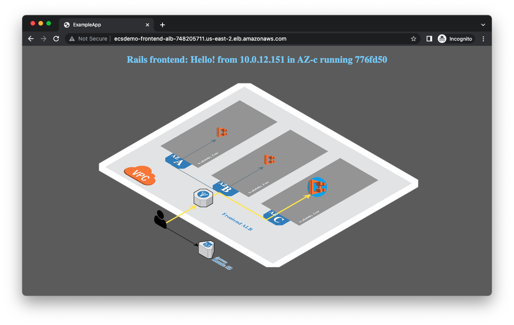

#### About

[Terraform by HashiCorp](https://www.terraform.io/) is an infrastructure automation tool that can be used to provision and manage resources on AWS.

This pattern will show how to deploy a load balanced web service using Amazon ECS and Terraform. It builds on top of the pattern ["Create an Amazon ECS cluster with Terraform"](/amazon-ecs-cluster-with-terraform)

#### Dependencies

- Terraform (tested version v1.2.5 on darwin_amd64)
- Git (tested version 2.27.0)
- AWS CLI
- AWS test account with administrator role access
- [Configure AWS credentials](https://docs.aws.amazon.com/cli/latest/userguide/cli-chap-configure.html)

#### Architecture

This pattern will create the following AWS resources:

!!! @/pattern/load-balanced-public-service-with-terraform/diagram.svg

* ALB: We are using Application Load Balancer for this service. Note the following key attributes for ALB:
  - ALB security group - allows ingress from any IP address to port 80 and allows all egress
  - ALB subnet - ALB is created in a public subnet
  - Listener - listens on port 80 for protocol HTTP
  - Target group - Since we are using Fargate launch type, the targe type is IP since each task in Fargate gets its own ENI and IP address. The target group has container port (3000) and protocol (HTTP) where the application container will serve requests. The ALB runs health check against all registered targets. In this example, ALB send HTTP GET request to path "/" to container port 3000. We are using target group default health check settings. You can tune these settings to adjust the time interval and frequency of health checks. It impacts how fast tasks become available to serve traffic. (See ALB target health check documentation to learn more.)
* ECR registry for the container image. We are using only one container image for the task in this example.
* ECS service definition:
  - Task security group: allows ingress for TCP from the ALB security group to the container service port (3000 for this example). And allows all egress.
  - Service discovery: You can register the service to AWS Cloud Map registry. You just need to provide the namespace but make sure the namespace is created in the core-infra step.
  - Tasks for this service will be deployed in private subnet
  - Service definition takes the load balancer target group created above as input.
  - Task definition consisting of task vCPU size, task memory, and container information including the above created ECR repository URL.
  - Task definition also takes the task execution role ARN which is used by ECS agent to fetch ECR images and send logs to AWS CloudWatch on behalf of the task.

#### Deploy the core infrastructure

If you have not already done so follow the instructions in ["Create an Amazon ECS cluster with Terraform"](/amazon-ecs-cluster-with-terraform) to setup the required underlying infrastructure that will support the ECS service.

::: info
This pattern and the core infrastructure pattern are designed to be decoupled and deployed into two different Terraform workspaces. The core infrastructure pattern creates underlying resources with a specific tag, and this pattern uses Terraform data lookups to locate those resources by looking for that specific tag. If you see an error message about not finding data, ensure that you are deploying the core infrastructure in the same AWS account and region, with the same tag `core-infra` that this pattern is expecting.
:::

#### Define the architecture

Download the following three files that define the load balanced service

<tabs>
<tab label="main.tf">

<!-- https://github.com/aws-ia/ecs-blueprints/blob/main/terraform/fargate-examples/lb-service/main.tf -->
<<< files/main.tf

</tab>
<tab label="outputs.tf">

<<< files/outputs.tf

</tab>
<tab label="versions.tf">

<<< files/versions.tf

</tab>
</tabs>

You should have three files:

- `main.tf` - Main file that defines the core infrastructure to create
- `outputs.tf` - A list of output variables that will be passed to other Terraform modules you may wish to deploy
- `versions.tf` - A definition of the underlying requirements for this module.

#### Deploy it

First we need to download all the dependency modules (defined in `versions.tf`) that this pattern relies on:

```shell
terraform init
```

Next we can review the deployment plan, and then deploy it:

```shell
terraform plan
terraform apply --auto-approve
```

When the Terraform apply is complete you will see output similar to this:

```
Apply complete! Resources: 17 added, 0 changed, 0 destroyed.

Outputs:
application_url = "http://ecsdemo-frontend-alb-748205711.us-east-2.elb.amazonaws.com"
```

#### Test it out

Load up the application URL in your browser. You should see a page similar to this:



The page will automatically refresh itself so that you can see traffic going to different instances of the backend container.

::: info
You may initially see a `503 Service Unavailable` message for about 30 seconds. This is because Terraform does not wait for the service to be fully healthy before it reaches "Apply complete" stage. This makes the Terraform apply faster, but means that the application startup will continue in the background for a about half a minute.
:::

#### Tear it down

You can use the following command to teardown the infrastructure that was created.

```shell
terraform destroy
```

#### See also

* Check out [the Github repository this pattern is sourced from](https://github.com/aws-ia/ecs-blueprints/tree/main/terraform/fargate-examples/lb-service).
* If you prefer to use AWS CloudFormation then see the [equivalent pattern for a public facing load balanced web service defined in CloudFormation YAML](/public-facing-web-ecs-fargate-cloudformation).